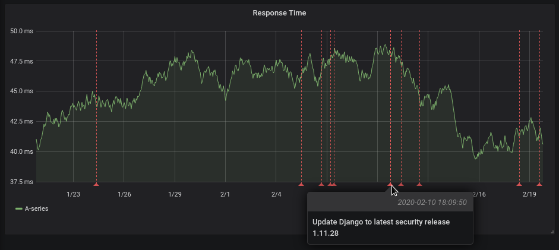

# Annotations for grafana from gitlab deployments

[](https://opensource.org/licenses/MIT)

Provides a grafana datasource to get annotations for each deployment in
gitlab. Useful to see whether code you deployed had any impact.



## Usage

```shell
$ go build
$ export GITLAB_URL=https://gitlab.example.com
$ export GITLAB_TOKEN=apitoken 
$ export HTTP_ADDRESS=:8080
$ ./gitlab-deployment-annotations
```

Log into grafana (`http://localhost:3000`) and add a SimpleJSON datasource
and point it to your datasource, e.g. ``http://localhost:8080``

Add annotations to a dashboard using your datasource and configure the query
(which accepts JSON), which allows you to select the project you want to
display, for example:

```json
{"project_id": 16, "environment": "Live"}
```

## Development

1. Build a grafana container image with the simple-json-datasource plugin
preinstalled using this Dockerfile:

```Dockerfile
FROM grafana/grafana
RUN grafana-cli --pluginsDir "$GF_PATHS_PLUGINS" plugins install grafana-simple-json-datasource
```

`$ docker build -t gf .`

2. Run a local instance of grafana

`$ docker run --net host gf`

3. Run and configure the datasource (see usage)